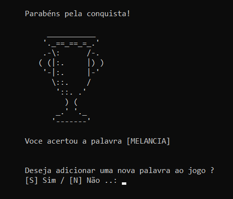
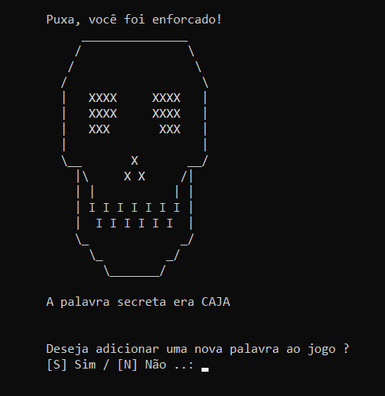

***

 **🔥 Projeto foi feito na linguagem `C` para obter base de conhecimento sobre a linguagem.**

 

**`🎮 Tela Inicial`**

**O jogo começa com a estrutura do jogo da forca, e conforme o jogador vai acertando letra que contenha na palavra secreta, o traço e substituido pela letra correspondente, caso contrario o boneco e desenhado na forca.**  

##

**`🏆 Vitoria do Jogador`**

**Quando o jogador acertar a palvra secreta, será apresentado o emoje do troféu no console do computador, com a opção de adicionar uma nova palavra ao jogo.**

##

**`❌ Derrota do Jogador`**

**Quando o jogador completa o boneco na forca, significa derrota do jogador, e o emoje da cavera será apresentado no console do computador, palvra secreta, com a opção de adicionar uma nova palavra ao jogo.**

##

**`📝 Adicionar Nova Palavra`**

**Conforme visto anteriormente, tanto em caso de vitoria quanto em caso de derrota no jogo, o jogador tem a opção de adicionar uma nova palavra ao jogo.**  
**Caso o Jogador queira inserir uma nova palavra digite a letra "S" em maiúsculo, inserindo a palavra, após inserir, uma mensagem de sucesso aparecerá.**  
**Caso o jogador não queira adicionar a nova palavra apenas insira a letra "N", e assim o jogo terminará.**

##

**`🚀 Tecnologias`**

  
  
  

 

    :octocat: Feito por Mateus Barros :octocat:

***
